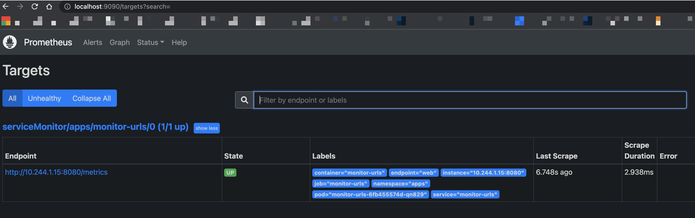
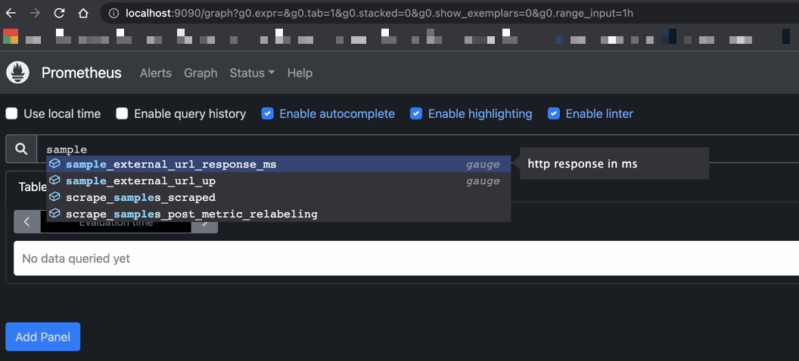
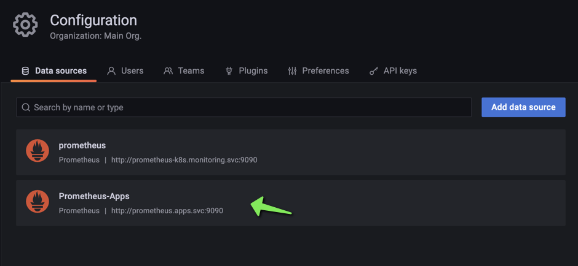
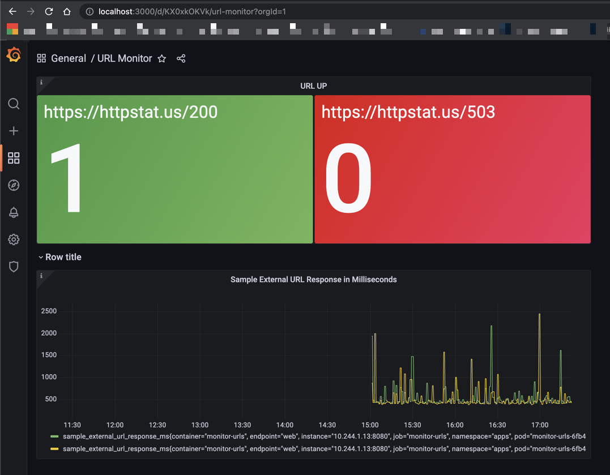

# Monitor Web apps by using Prometheus

Simple service that watches external URLs, exports custom metrics to Prometheus
and finally shows those metrics in Grafana.

- App code (made using Golang), tests and Dockerfile are found in the [app](app/) folder.
- Kubernetes Deployment specification for **App** is found in [deploy](deploy/app/) folder.
- Kubernetes Deployment specification for **Prometheus** is found in [deploy](deploy/prometheus/) folder.
- Custom Grafana dashboard is found in [grafana](grafana/) folder.

## Prerequisites

Code has been tested with the following tools:

- Docker  20.10.20
- Kind    v0.17.0
- Kubectl v1.25.2
- Git     2.37.0

## Install Kind

[kind](https://sigs.k8s.io/kind) is a tool for running local Kubernetes clusters using Docker container “nodes”.

```shell
make kind-create-cluster
```

Allow a couple of minutes while cluster nodes are running and ready. Use below command to check cluster node status:

```shell
kubectl get no
```

## Install Kube Prometheus on Kubernetes cluster

Using the community manifests from [repo](https://github.com/prometheus-operator/kube-prometheus)

Using `release-0.10` for compatibility with Kubernetes 1.23. Check the [compatibility matrix](https://github.com/prometheus-operator/kube-prometheus#compatibility)

```shell
make kube-prometheus-install
```

Allow a couple of minutes while all the pods are running and ready. Use below command to check pods status:

```shell
kubectl -n monitoring get pods
```

## Build Docker image

This will use [Docker](https://docs.docker.com/) to build image locally:

```shell
make docker-build
```

## Deploy and Access Application metrics

```shell
make deploy-app
```

Allow a couple of minutes while the App pod is running and ready. Use below command to check pod status:

```shell
kubectl -n apps get pods
```

Then port forward App service:
```shell
kubectl -n apps port-forward svc/monitor-urls 8080
```

Then navigate on `localhost:8080/metrics`

**Note**: Ctrl+C to finish port forwarding

## Deploy Prometheus instance and Service Monitor for App

```shell
make deploy-prometheus-monitor
```

Allow a couple of minutes while Prometheus pod is running and ready. Use below command to check pods status:

```shell
kubectl -n apps get pods
```

Then port forward to Prometheus service:
```shell
kubectl -n apps port-forward svc/prometheus 9090
```

Then navigate on `localhost:9090/targets`

You should see how Prometheus is now scraping the App



**Note**: Ctrl+C to finish port forwarding

## Access Grafana Dashboards

```shell
kubectl -n monitoring port-forward svc/grafana 3000
```

Then navigate on `localhost:3000`
- Username: `admin`
- Password: `admin`

It will force you to change password.

### Add Prometheus instance as new data source in Grafana

1. Go to `Configuration->Data sources->Add data source`
2. Select `Prometheus`
3. Set Data Source Name: `Prometheus-Apps`
4. Set URL: `http://prometheus.apps.svc:9090`
5. Click `Save & test`

New Data source should show after successful completion:


### Import custom Grafana dashboard

1. Go to `Create->Import->Upload JSON File`
2. Open JSON file [URL-Monitor-Dashboard](grafana/URL-Monitor-Dashboard.json)
3. Select Data Source: `Prometheus-Apps`

New Dashboard should show after successful completion:


**Note**: Ctrl+C to finish port forwarding

## Delete everything

```shell
make kind-delete-cluster
```
